#[fit].
#[fit] git pratcical cases

Tomasz Gebarowski
@tgebarowski
github.com/tgebarowski/

---

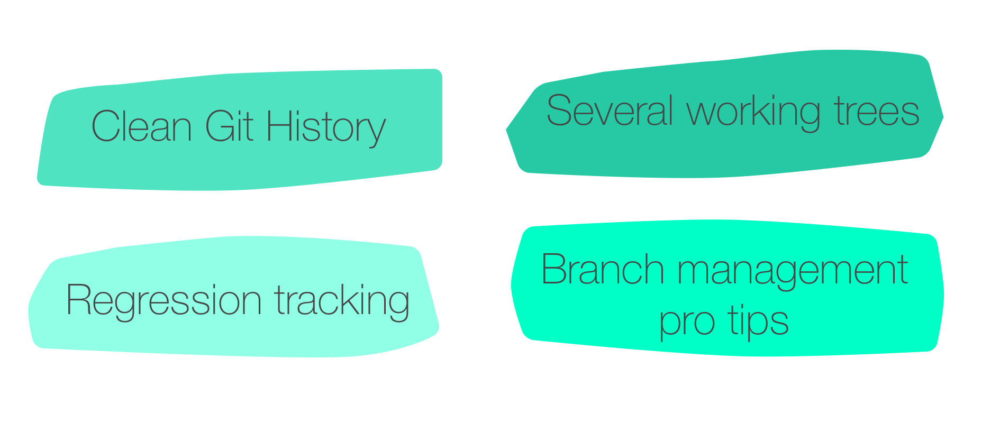

---

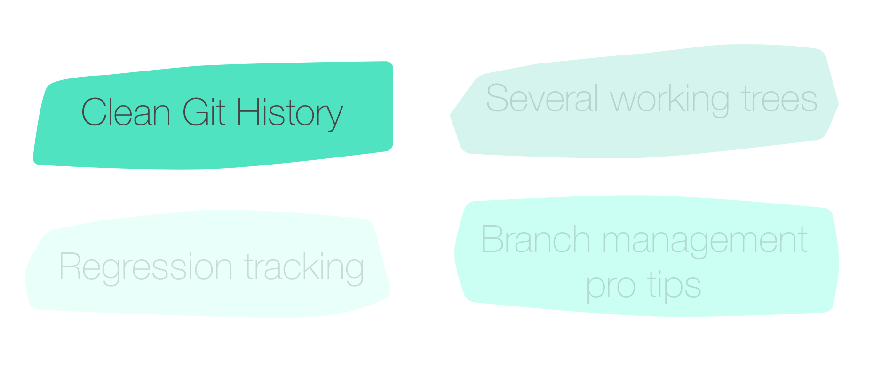

---

# Typical work flow

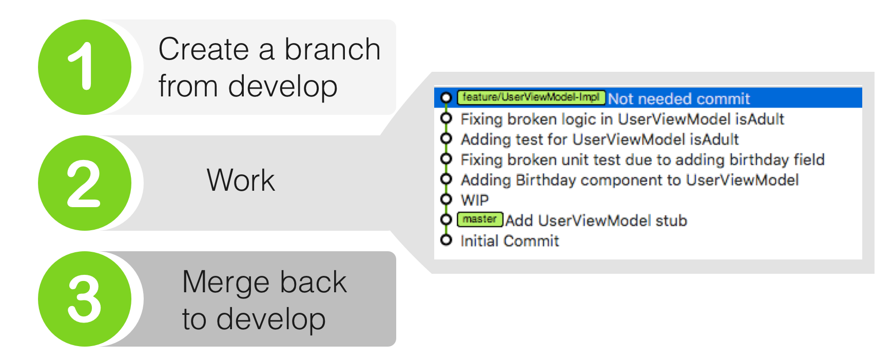

---

# git merge

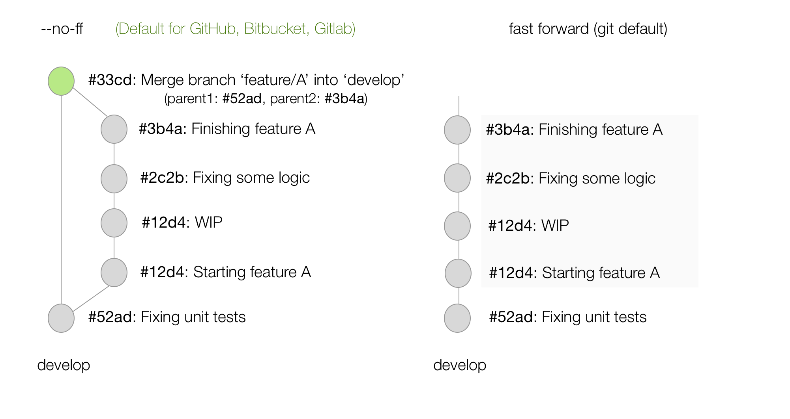

---

# ¿ Fast forward or not ?

- Merge with fast forward is hard to revert
  - No single commit to revert
  - History is linear

---

# but wait...


#[fit]🤔

# linear history is easier to search (bisect, blame, log)

---


1. rebase
2. create PR after rebase
3. merge with --no-ff

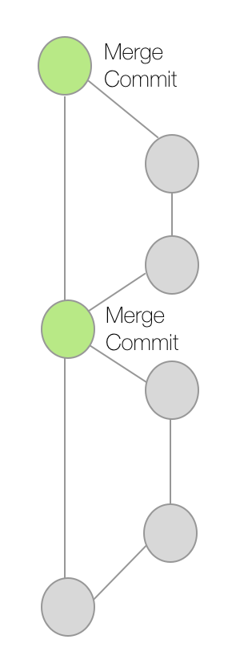

---


- Conflicts are harder to resolve when rebasing
- Commit hash is re-generated
- Extra step

---

# Let's go back to our example

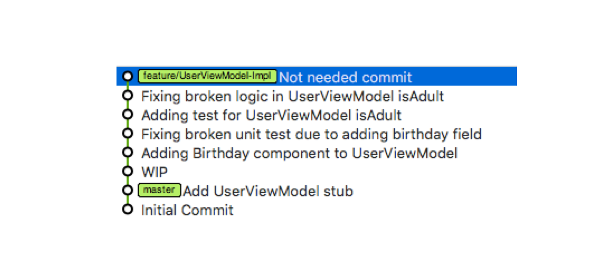

---

# What are the pitfalls ?

- Feature branches often have snapshot (WIP) commits

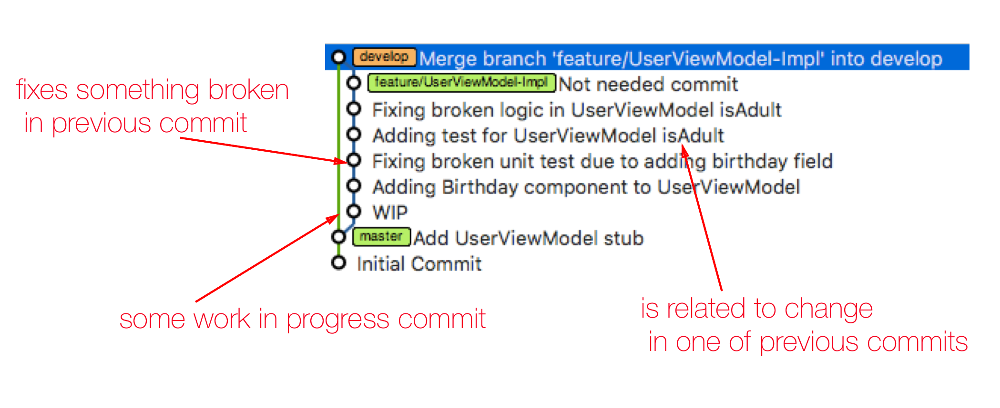

---

# Why snapshot commits are bad?

- Usually break the build
- Frequently do not pass unit tests
- Create line noise: One commit fixes another in the same feature branch

---

# Why do we make them?

- Adhoc commits are faster and easier to make
- We need checkpoints in our code
- Before intermediate code reviews

---

# They get merged into develop


# Breaking git bisect, leaving develop in messy state

---

# What are the options


---

# Let's be clean...

---

# Clean history (branch types)

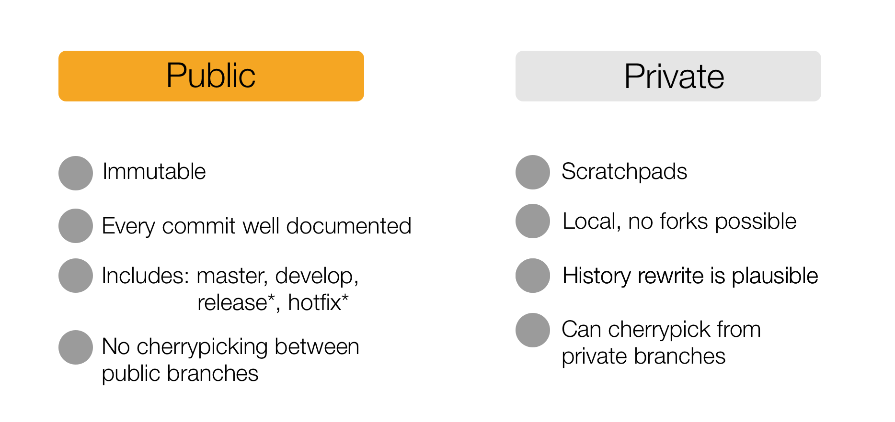

---


# history rewrite?

---


# *if you work on a private branch

---

# History rewrite tips

---

# Rewriting history

It's all about git rebase:

`git rebase -i HEAD~N`
`git rebase -i SHA`

where:
- __N__, number of commits we want to go back to rewrite history
- __SHA__ of previous commit before the commit we want to include in our history rewrite

---

# git rebase -i HEAD~6

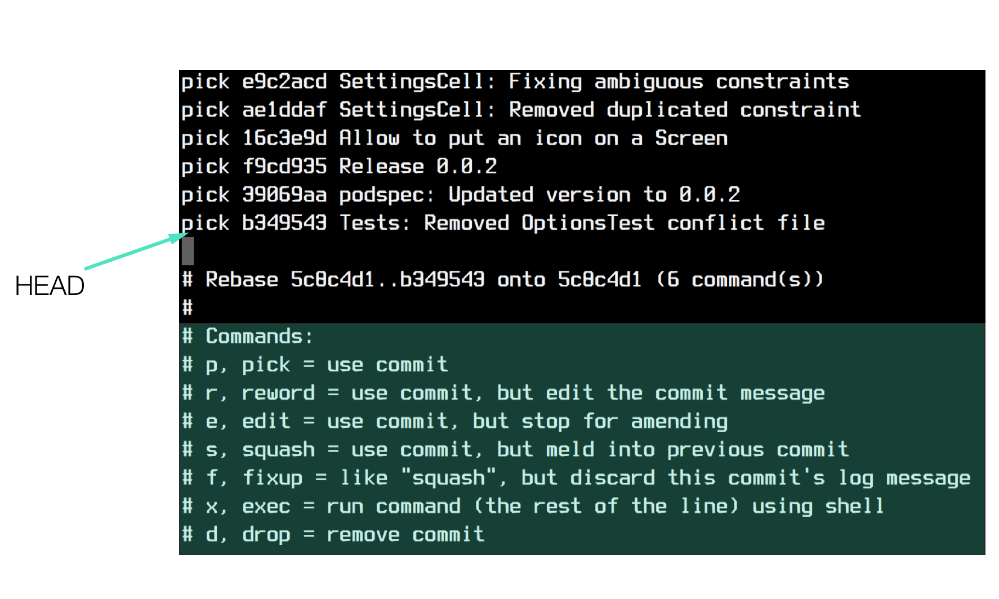

# Squashing

Sometimes we want to squash two commits into one.

We can do it either manually using `git rebase -i` by reordering
commits and prefixing them with "s"

# There is a better way!

---

# Squashing with __fixup!__ (1)

- add commit that is to be squashed with one of the commits from history
- prefix it with __fixup!__ and add the same commit message as the commit that is rewritten

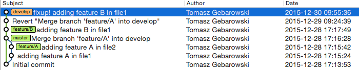

---

# Squashing with __fixup!__ (2)

- rebase with autosquash option

`git rebase -i --autosquash HEAD~3`

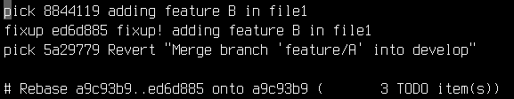

---

# Amending merge commit

`git commit --amend -p` (or --preserve-merges)

`git rebase -i -p`

git will try to preserve the merges when rebasing, rather than linearizing the history

---

# Reverting Merge Commit

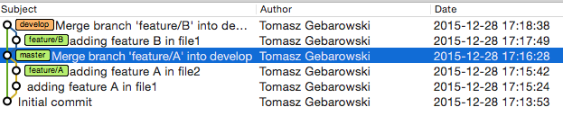

`git revert -m 1 a9c93b99d`

where: *a9c93b99d* is Merge Request hash

---

# Reverting Merge Commit

After:

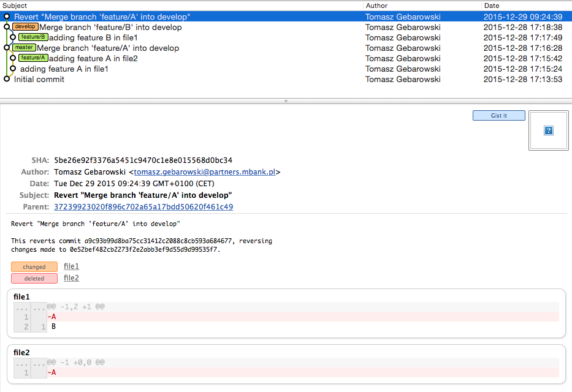

---

# Diff after rebase (?)

Before each rewrite it is advised to tag your current HEAD:

`git tag v1`

then after:

`git rebase -i HEAD~4`

you can compare what changed after rewrite:

`git diff v1 HEAD`

---

# Diff after rebase (2)

What if you forgot to tag before rebase -i?

```
git tag v2 tomasz/feature/rcs
```

(before history got rewritten in remote)

---

# Pitfalls

- Changing commits may result in conflicts
- It takes time to rearranged already committed code

# Benefits

- Commits treated as code documentation
- Well organized commits are easier to review
- No problems with git bisect

---

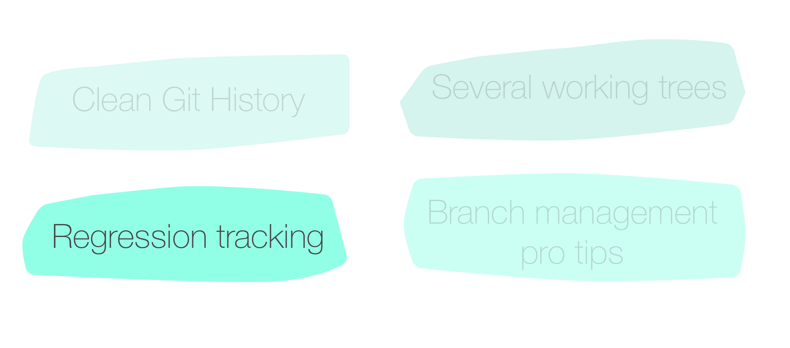

---

# Regression tracking with git bisect

### Binary search of commit that caused error

---

# Regression tracking: git bisect


- __Setup__

`$ git bisect start`
`$ git bisect bad`
`$ git bisect good 12d4`

`Bisecting: 3 revisions left to test after this (roughly 2 steps)`

---

# Regression tracking: git bisect

- __Test 1__


`git bisect bad`
`Bisecting: 0 revisions left to test after this (roughly 0 steps)`

---

# Regression tracking: git bisect

- __Test 2__

`$ git bisect good`


---

# Regression tracking: git bisect

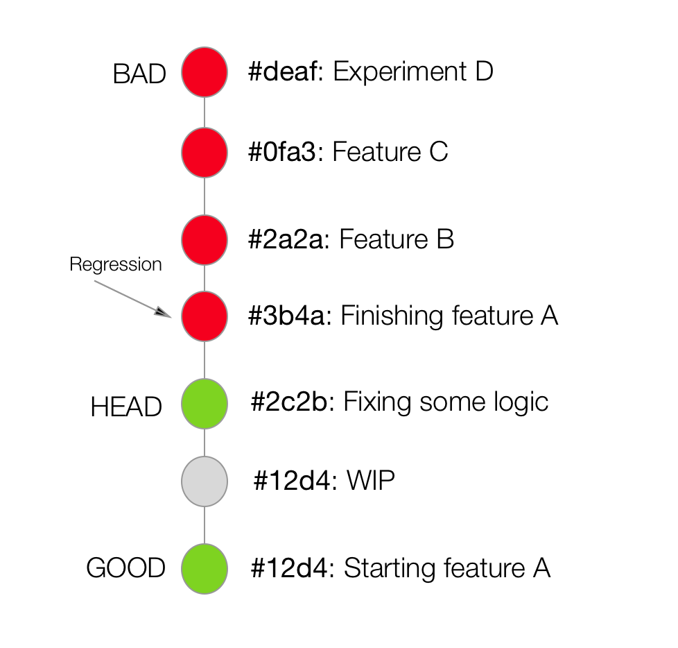

---

- __Results__

`3b4a is first bad commit`

Remember to call `git bisect reset`, to bring back original `HEAD` state

---

# Automatic regression tracking

`git bisect start`
`git bisect bad`
`git bisect good 12d4`
`git bisect run ./test.sh`

###test.sh:
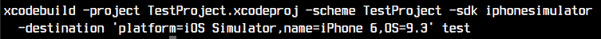

---

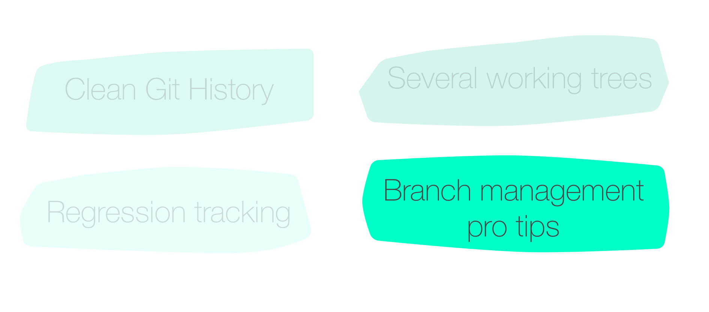

---

# Successful Git Branching Model


Source: http://nvie.com/posts/a-successful-git-branching-model/

---

# Branch difference tracking (1)

Lists commits that are in release-1.2 but not in master:

`git log --no-merges master..release-1.2`

Lists commits that are in develop but not in master:

`git log --no-merges master..develop`

---

# Branch difference tracking (2)

This should *ALWAYS* return empty results in proper git flow:

`git log --no-merges develop..master`

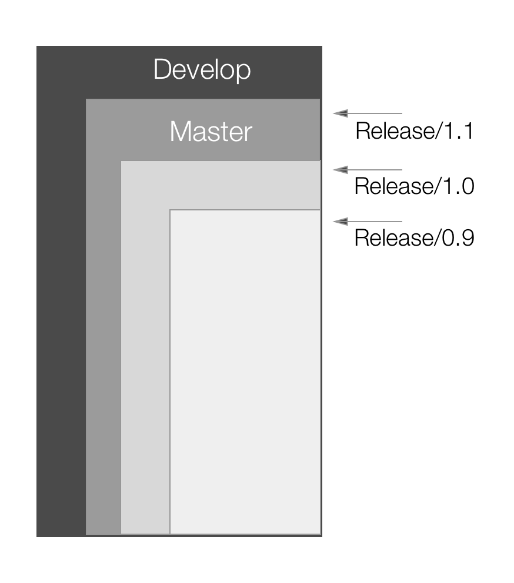


---

# Listing not merged branches

Remote branches not merged with develop

```
git branch -r --no-merged origin/develop
```

Local branches not merged with develop

```
git branch --no-merged develop
```

---

# beware of cherry-pick

#[fit] 😱

- Cherry-pick is not a golden bullet
- It generates new hash every time
- Do not cherry-pick changes between develop, master and release- branches because git will treat those changes as independent, not related commits

---

# when to use cherry-pick?

- when there is no other choice and changes can't be integrated easily
- when working with your local branches

---

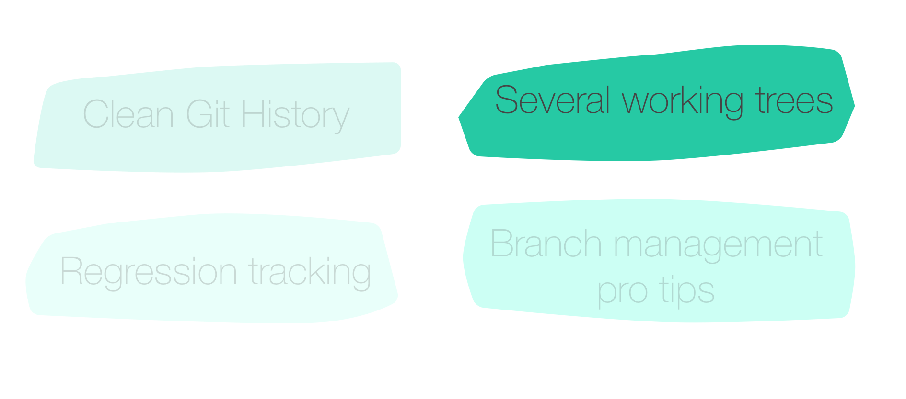

---

# Several worktrees (1)

Consider following scenario:

- Working on a feature branch
- Urgent hotfix on a master branch

---

# Several worktrees (2)

What would you do?

```
git stash
git checkout master
git checkout -b hotfix
```
---

# Several worktrees (3)

There is better way:

```
git worktree add -b hotfix ../hotfix origin/master
cd ../hotfix
(bugfixing)

git push origin hotfix
(pull request)

cd ../main
rm -rf ../hotfix
(cleanup)
```

---

# what about live demo?


---

#[fit].
#[fit] Thank You

Tomasz Gebarowski
@tgebarowski
github.com/tgebarowski/